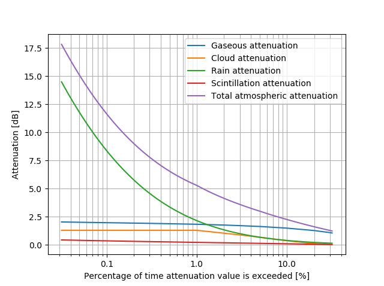
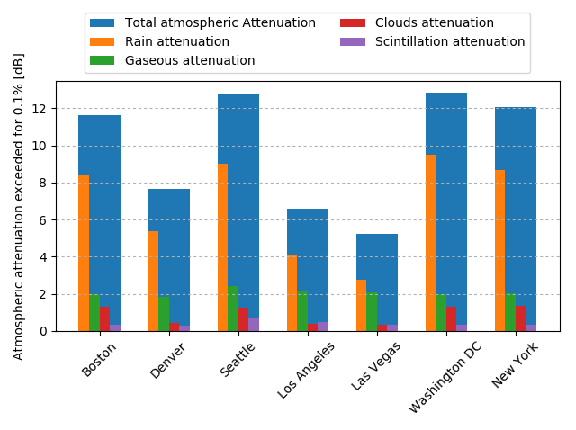
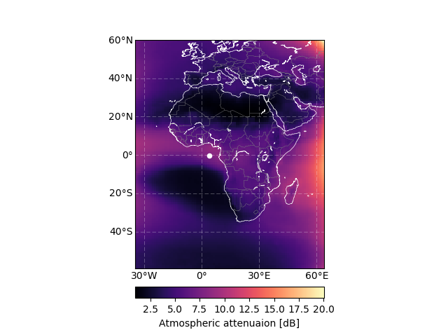
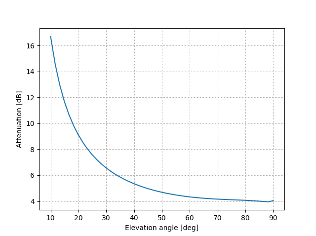
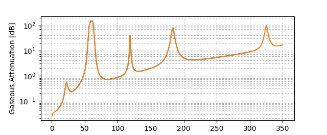

Quick Start
===========

If you have not installed *ITU-Rpy* yet take a look at the `installation instructions <installation.html>`_ and make sure that all the requirements are fulfilled.
Examples to illustrate the usage of *ITU-Rpy* are provided in the examples-folder. In order to understand the models used, check the `models section <apidoc/models.html>`_ .

To get started, we will walk you through a few examples that show the most illustrative case studies for 

* First, we explain the basic usage of *ITU-Rpy* by computing the attenuation at a single location.
* Second, we explain the usage of *ITU-Rpy* using vectorized operations.
* Finally, we summarize other useful atmospheric functions in the library. The complete API description can be accessed through the `API section <api.html>`_ .

Single location attenuation
---------------------------

Here we will compute the link attenuation vs. at a frequency of 22.5 GHz for a link between a satellite in GEO at the orbital slot 77 W and a ground station in Boston.

In addition, we will show how to compute other parameters of interest such as 0 degree isotherm, rainfall intensity exceeded during 0.01 % of the time, total columnar content liquid water or temperature.

First, let's define the coordinates of our ground station and compute the elevation angle of the link

.. code-block:: python

	import itur
	import astropy.units as u
	
	# Ground station coordinates (Boston)
	lat_GS = 42.3601
	lon_GS = -71.0942
	
	# Satellite coordinates (GEO, 77 W)
	lat_sat = 0
	lon_sat = -77 
	h_sat = 35786 * u.km
	
	# Compute the elevation angle between satellite and ground station
	el = itur.utils.elevation_angle(h_sat, lat_sat, lon_sat, lat_GS, lon_GS)
	

Next, we define the link parameters

.. code-block:: python

	f = 22.5 * u.GHz    # Link frequency
	D = 1.2 * u.m       # Antenna diameters

Finally, we compute the total atmospheric attenuation as well as the different contributions for a set of unavailability values and plot the results. Note the flag `return_contributions = True` when calling function `itur.atmospheric_attenuation_slant_path`.

.. code-block:: python

	import numpy as np
	import matplotlib.pyplot as plt
	from matplotlib.ticker import ScalarFormatter

	# Define unavailabilities vector
	unavailabilities = np.logspace(-1.5, 1.5, 100)
	
	# Compute the 
	A_g, A_c, A_r, A_s, A_t = [], [], [], [], []
	for p in unavailabilities:
		a_g, a_c, a_r, a_s, a_t = itur.atmospheric_attenuation_slant_path(lat_GS, lon_GS, 
                                                                                  f, el, p, D,
                                                                                  return_contributions=True)
		A_g.append(a_g.value)
		A_c.append(a_c.value)
		A_r.append(a_r.value)
		A_s.append(a_s.value)
		A_t.append(a_t.value)
		
	# Plot the results
	ax = plt.subplot(1,1,1)
	ax.semilogx(unavailabilities, A_g, label='Gaseous attenuation')
	ax.semilogx(unavailabilities, A_c, label='Cloud attenuation')
	ax.semilogx(unavailabilities, A_r, label='Rain attenuation')
	ax.semilogx(unavailabilities, A_s, label='Scintillation attenuation')
	ax.semilogx(unavailabilities, A_t, label='Total atmospheric attenuation')

	ax.xaxis.set_major_formatter(ScalarFormatter())
	ax.set_xlabel('Percentage of time attenuation value is exceeded [%]')
	ax.set_ylabel('Attenuation [dB]')
	ax.grid(which='both', linestyle=':')
	plt.legend()
	
which results in the following plot image:	
	

   Atmospheric attenuation at Boston for a link to GEO - 77 W.
   
Note the by default, *ITU-Rpy* returns Quantity type objects, which are based on `astropy.units` module. Quantity objects are special objects that contain a `value` and `unit` attributes. Conversion among units is possible using the `.to()` method.

Atmospheric parameters such as temperature, pressure, or water-vapor density can be passed to function `itur.atmospheric_attenuation_slant_path` manually if known, otherwise *ITU-Rpy* will compute them automatically using the appropriate ITU Recommendation models. Similarly, if the ground station height above mean sea level is known, it can also be introduced manually.

Vectorial operations
--------------------

One of the main characteristics of *ITU-Rpy* is that it allows for broadcasting of operations when using vectors. This allows for several use cases.

Multiple cities
^^^^^^^^^^^^^^^

First, we might be interested in computing the atmospheric attenuation values exceeded for 0.1 % of the time for a bunch of locations. This can be done as:

.. code-block:: python

	import itur
	cities = {'Boston': (42.36, -71.06),
	          'New York': (40.71, -74.01),
	          'Los Angeles': (34.05, -118.24),
	          'Denver': (39.74, -104.99),
	          'Las Vegas': (36.20, -115.14),
	          'Seattle': (47.61, -122.33),
	          'Washington DC': (38.91, -77.04)}

	lat = [coords[0] for coords in cities.values()]
	lon = [coords[1] for coords in cities.values()]

	# Satellite coordinates (GEO, 4 E)
	lat_sat = 0
	lon_sat = -77
	h_sat = 35786 * itur.u.km

	# Compute the elevation angle between satellite and ground stations
	el = itur.utils.elevation_angle(h_sat, lat_sat, lon_sat, lat, lon)

	# Set the link parameters
	f = 22.5 * itur.u.GHz    # Link frequency
	D = 1.2 * itur.u.m       # Antenna diameters
	p = 0.1                  # Unavailability (Values exceeded 0.1% of time)

	# Compute the atmospheric attenuation
	Ag, Ac, Ar, As, Att = itur.atmospheric_attenuation_slant_path(
		lat, lon, f, el, p, D, return_contributions=True)
		
and we can plot the results

.. code-block:: python

	# Plot the results
	city_idx = np.arange(len(cities))
	width = 0.15

	fig, ax = plt.subplots(1, 1)
	ax.bar(city_idx, Att.value, 0.6, label='Total atmospheric Attenuation')

	ax.bar(city_idx - 1.5 * width, Ar.value, width, label='Rain attenuation')
	ax.bar(city_idx - 0.5 * width, Ag.value, width, label='Gaseous attenuation')
	ax.bar(city_idx + 0.5 * width, Ac.value, width, label='Clouds attenuation')
	ax.bar(city_idx + 1.5 * width, As.value, width,
		   label='Scintillation attenuation')

	# Set the labels
	ticks = ax.set_xticklabels([''] + list(cities.keys()))
	for t in ticks:
		t.set_rotation(45)
	ax.set_ylabel('Atmospheric attenuation exceeded for 0.1% [dB]')

	# Format image
	ax.yaxis.grid(which='both', linestyle=':')
	ax.legend(loc='upper center', bbox_to_anchor=(0.5, 1.3), ncol=2)
	plt.tight_layout(rect=(0, 0, 1, 0.85))
	
	

   Atmospheric attenuation exceeded for 0.1 % of the average year in different cities of the US.
   
Attenuation over regions of the Earth
^^^^^^^^^^^^^^^^^^^^^^^^^^^^^^^^^^^^^

A second use case for vectorization is computation of the atmospheric attenuation (and other parameters) over large geographical regions. Let's say that we want to compute the attenuation over Africa of a new Ka-band satellite located in GEO at slot 4 E.

.. code-block:: python

	import itur
	import astropy.units as u
	
	# Generate regular grid of latitude and longitudes with 1 degree resolution
	lat, lon = itur.utils.regular_lat_lon_grid(lat_max=60, 
                                                   lat_min=-60,
                                                   lon_max=65,
                                                   lon_min=-35)
	
	# Satellite coordinates (GEO, 4 E)
	lat_sat = 0
	lon_sat = 4 
	h_sat = 35786 * u.km
	
	# Compute the elevation angle between satellite and ground station
	el = itur.utils.elevation_angle(h_sat, lat_sat, lon_sat, lat, lon)

	f = 22.5 * u.GHz    # Link frequency
	D = 1.2 * u.m       # Antenna diameters
	p = 1               # Unavailability (Values exceeded 1% of time)
	Att = itur.atmospheric_attenuation_slant_path(lat, lon, f, el, p, D)

If you have installed Basemap (see `installation instructions <installation.html>`_ ), you can use function `itur.utils.plot_in_map()` to display the results as an image:

.. code-block:: python

	# Plot the results
	m = itur.utils.plot_in_map(Att.value, lat, lon, 
                                   cbar_text='Atmospheric attenuation [dB]',
                                   cmap='magma')
	
	# Plot the satellite location
	m.scatter(lon_sat, lat_sat, c='white', s=20)
						   

   Atmospheric attenuation over Africa @ 22.5 GHz.
   

Dependency with link parameters
^^^^^^^^^^^^^^^^^^^^^^^^^^^^^^^
   
Vectorization works in a lot of different ways. For example, let's say that we want to compute the dependency of the attenuation with the elevation angle for a the example presented in the `Single location attenuation example <>`_. We can just do it using the code below

.. code-block:: python

	import itur
	import astropy.units as u
	
	itur.deactivate_output_quantity()
	
	# Ground station coordinates (Boston)
	lat_GS = 42.3601
	lon_GS = -71.0942
	
	# Vectorize the elevation angle
	el = np.linspace(10, 90, 50)
	
	f = 22.5 * u.GHz    # Link frequency
	D = 1.2 * u.m       # Antenna diameters
	p = 1               # Unavailability (Values exceeded 1% of time)
	Att = itur.atmospheric_attenuation_slant_path(lat_GS, lon_GS, f, el, p, D)
	
	plt.figure()
	plt.plot(el, Att.value)
	plt.xlabel('Elevation angle [deg]')
	plt.ylabel('Attenuation [dB]')
	plt.grid(which='major', linestyle=':')
	

   Atmospheric attenuation at Boston vs. elevation angle.
   
Another example of vectorization can be found below in the code to plot the atmospheric attenuation due to gases vs. frequency.

.. code-block:: python

	import itur
	import astropy.units as u
	import numpy as np
	
	el = 90
	rho = 7.5 * u.g / u.m**3
	P = 1013 * u.hPa
	T = 25 * u.deg_C
	f = np.linspace(1, 350, 1000)
	
	Att = itur.gaseous_attenuation_slant_path(f, el, rho, P, T)
	plt.semilogy(f, Att)
	plt.xlabel('Frequency [GHz]')
	plt.ylabel('Gaseous Attenuation [dB]')
	plt.grid(which='both', linestyle=':')
	
	

   Gaseous attenuation vs. frequency.
   
The only parameter that cannot be vectorized is the unavailability - percentage of time that values are exceeded. A `for` loop needs always to be used to compute attenuation values for different unavailabilities (`p`), as was shown in the `Single location attenuation example <>`_.

Other atmospheric functions
---------------------------

We conclude the quickstart with a summary of other functions included in *ITU-Rpy* that might be useful to compute atmospheric attenuation related parameters. The complete API description can be accessed through the `API section <apidoc/models.html>`_ .

.. code-block:: python

	import itur

	# Location of the receiver ground stations
	lat = 41.39
	lon = -71.05

	# Link parameters
	el = 60                # Elevation angle equal to 60 degrees
	f = 22.5 * itur.u.GHz  # Frequency equal to 22.5 GHz
	D = 1 * itur.u.m       # Receiver antenna diameter of 1 m
	p = 0.1                # We compute values exceeded during 0.1 % of the average
						   # year

	# Compute atmospheric parameters
	hs = itur.topographic_altitude(lat, lon)
	T = itur.surface_mean_temperature(lat, lon)
	P = itur.pressure(lat, hs)
	rho_p = itur.surface_water_vapour_density(lat, lon, p, hs)
	rho_sa = itur.models.itu835.water_vapour_density(lat, hs)
	T_sa = itur.models.itu835.temperature(lat, hs)
	V = itur.models.itu836.total_water_vapour_content(lat, lon, p, hs)

	# Compute rain and cloud-related parameters
	R_prob = itur.models.itu618.rain_attenuation_probability(lat, lon, el, hs)
	R_pct_prob = itur.models.itu837.rain_percentage_probability(lat, lon)
	R001 = itur.models.itu837.rainfall_rate(lat, lon, p)
	h_0 = itur.models.itu839.isoterm_0(lat, lon)
	h_rain = itur.models.itu839.rain_height(lat, lon)
	L_red = itur.models.itu840.columnar_content_reduced_liquid(lat, lon, p)
	A_w = itur.models.itu676.zenit_water_vapour_attenuation(lat, lon, p, f, alt=hs)

	# Compute attenuation values
	A_g = itur.gaseous_attenuation_slant_path(f, el, rho_p, P, T)
	A_r = itur.rain_attenuation(lat, lon, f, el, hs=hs, p=p)
	A_c = itur.cloud_attenuation(lat, lon, el, f, p)
	A_s = itur.scintillation_attenuation(lat, lon, f, el, p, D)
	A_t = itur.atmospheric_attenuation_slant_path(lat, lon, f, el, p, D)
	
Running the code above produces the following results. The ITU Recommendation where the variable or the procedure to compute it is referred appears in square brackets.

.. code-block:: bash

	The ITU recommendations predict the following values for the point located 
	at coordinates (41.39, -71.05)
	  - Height above the sea level                  [ITU-R P.1511]      22.9 m
	  - Surface mean temperature                    [ITU-R P.1510]      9.4 deg_C
	  - Surface pressure                            [ITU-R P.835]       1005.4 hPa
	  - Standard surface temperature                [ITU-R P.835]       13.6 deg_C
	  - Standard water vapour density               [ITU-R P.835]       8.9 g / m3
	  - Water vapor density (p=0.1%)                [ITU-R P.836]       20.3 g / m3
	  - Total water vapour content (p=0.1%)         [ITU-R P.836]       54.6 kg / m2
	  - Rain attenuation probability                [ITU-R P.618]       9.6 %
	  - Rain percentage probability                 [ITU-R P.837]       7.8 %
	  - Rainfall rate exceeded for p=0.1%           [ITU-R P.837]       12.9 mm / h
	  - 0 degree C isotherm height                  [ITU-R P.839]       3.2 km
	  - Rain height                                 [ITU-R P.839]       3.5 km
	  - Columnar content of reduced liquid (p=0.1%) [ITU-R P.840]       3.0 kg / m2
	  - Zenit water vapour attenuation (p=0.1%)     [ITU-R P.676]       1.5 dB

	Attenuation values exceeded for p=0.1% of the average year for a link with el=60 deg, f=22.5 GHz, 
	D=1.0 m and receiver ground station located at coordinates (41.39, -71.05)
	  - Rain attenuation                            [ITU-R P.618]       8.2 dB
	  - Gaseous attenuation                         [ITU-R P.676]       1.5 dB
	  - Clouds attenuation                          [ITU-R P.840]       1.6 dB
	  - Scintillation attenuation                   [ITU-R P.618]       0.3 dB
	  - Total atmospheric attenuation               [ITU-R P.618]       10.8 dB
